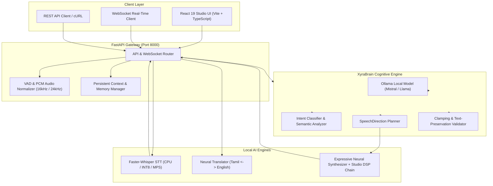

# 🎙️ XyraSpeech — Local Multilingual Speech Intelligence & Voice Studio

[](https://www.python.org/)
[](https://fastapi.tiangolo.com/)
[](https://react.dev/)
[](https://ollama.com/)
[]()
[](LICENSE)

> **XyraSpeech** is a production-quality, local-first multilingual voice platform and cognitive speech intelligence engine specifically optimized for **Tamil (`ta`)** and **Indian & International English (`en`)**. It unifies real-time speech-to-text (STT), cognitive conversation planning with persistent memory, neural speech synthesis with studio acoustic mastering, and bidirectional translation into an ultra-low-latency, real-time platform.

---

## 📑 Table of Contents

- [Overview](#-overview)
- [System Architecture](#-system-architecture)
- [Core Capabilities](#-core-capabilities)
- [Voice Profiles & Neural Engines](#-voice-profiles--neural-engines)
- [Studio Acoustic Mastering DSP Chain](#-studio-acoustic-mastering-dsp-chain)
- [Project Structure](#-project-structure)
- [Prerequisites](#-prerequisites)
- [Installation & Quickstart](#-installation--quickstart)
- [API Reference](#-api-reference)
  - [1. Health & Engine Status](#1-health--engine-status)
  - [2. Voice Library](#2-voice-library)
  - [3. Neural Text-to-Speech (TTS)](#3-neural-text-to-speech-tts)
  - [4. Speech-to-Text (STT)](#4-speech-to-text-stt)
  - [5. Neural Translation](#5-neural-translation)
  - [6. Cognitive Conversational Agent](#6-cognitive-conversational-agent)
  - [7. Real-Time WebSocket Streaming](#7-real-time-websocket-streaming)
- [React 19 Studio UI](#-react-19-studio-ui)
- [Running Automated Tests](#-running-automated-tests)
- [License](#-license)

---

## 🌟 Overview

XyraSpeech solves the challenge of robotic, unnatural synthetic speech for Indic languages by separating **Cognitive Speech Intelligence (XyraBrain)** from the **Downstream Neural Audio Synthesizer (TTS)**.

```text
User Speech / Input
        │
        ▼
   [ Faster-Whisper STT ]
        │
        ▼
   [ XyraBrain Intelligence Layer (Ollama) ]
   ├── Language Preservation & Code-Switching (ta / en)
   ├── Intent Classification & Conversational Memory
   └── Emotion, Prosody, Speed, Pitch & Boundary Direction
        │
        ▼
   [ Studio DSP Audio Mastering Chain (FFmpeg) ]
   ├── Chest Warmth & Articulation Parametric EQ
   ├── Dynamic Broadcast Compression & De-Essing
   └── Acoustic Micro-Room Depth
        │
        ▼
   [ Expressive Neural Audio Waveform ]
```

---

## 🏗️ System Architecture



---

## 🚀 Core Capabilities

1. **XyraBrain Cognitive Speech Direction**:
   - Analyzes text semantics and maps them into fine-grained performance metadata: emotion (`warm`, `excited`, `empathetic`, `calm`, `serious`, etc.), delivery style (`conversational`, `friendly`, `professional`), energy (`0.0 - 1.0`), speed (`0.5 - 1.5`), pitch (`0.8 - 1.2`), word emphasis, and pause insertion.
2. **Authentic Human-Grade Tamil (`ta`) & Indian English (`en`) Voices**:
   - Neural expressive models (`ta-IN-PallaviNeural`, `ta-IN-ValluvarNeural`, `en-IN-NeerjaExpressiveNeural`, `en-IN-PrabhatNeural`) delivering natural intonation, vowel elongation, and human cadence.
3. **Conversational Turn-Taking with Session Memory**:
   - Retains conversation context, user names, topics, and preferences across multiple dialogue turns.
4. **Local Speech Recognition (STT)**:
   - High-speed transcription powered by `faster-whisper` with segment timestamps, confidence scores, and language detection.
5. **Bidirectional Tamil $\leftrightarrow$ English Neural Translation**:
   - High-fidelity context-aware translation between Tamil and English.
6. **Real-Time WebSocket Streaming & Barge-In**:
   - Full-duplex WebSocket communication supporting live audio streaming, sentence chunking, and instant cancellation upon user interruption.

---

## 🎭 Voice Profiles & Neural Engines

| Voice ID | Display Name | Language | Gender | Engine | Description |
| :--- | :--- | :---: | :---: | :---: | :--- |
| `ta_pallavi` ⭐ | **Xyra Tamil (Pallavi)** | `ta` | Female | `Neural Expressive` | Ultra-natural, human-grade Indian Tamil female voice. *(Default Tamil)* |
| `ta_valluvar` | **Xyra Tamil (Valluvar)** | `ta` | Male | `Neural Expressive` | Deep, authentic Indian Tamil male voice with natural cadence. |
| `en_neerja` ⭐ | **Xyra Indian English (Neerja)** | `en` | Female | `Neural Expressive` | Warm, expressive Indian English female voice. *(Default English)* |
| `en_prabhat` | **Xyra Indian English (Prabhat)** | `en` | Male | `Neural Expressive` | Clear, confident Indian English male voice. |
| `en_samantha` | **Xyra English (Samantha)** | `en` | Female | `Mac Native` | Standard US English natural female voice. |
| `en_daniel` | **Xyra British English (Daniel)** | `en` | Male | `Mac Native` | British English voice tuned for narration. |
| `en_tara` | **Xyra Indian English (Tara)** | `en` | Female | `Mac Native` | Local offline melodic Indian English female voice. |
| `ta_vani` | **Xyra Tamil (Vani - Local)** | `ta` | Female | `Mac Native` | Local offline Tamil voice fallback. |
| `en_rishi` | **Xyra Indian English (Rishi)** | `en` | Male | `Mac Native` | Local offline Indian English male voice fallback. |

---

## 🎛️ Studio Acoustic Mastering DSP Chain

Every synthesized audio stream passes through an advanced **FFmpeg Digital Signal Processing (DSP)** mastering pipeline to eliminate digital harshness and produce warm broadcast-quality sound:

```
[ Raw Synthesis Stream ]
          │
          ▼
   1. High-Pass Filter (75 Hz) ─────────────> Eliminates mechanical rumble & sub-bass plosives
          │
          ▼
   2. Chest Warmth Parametric EQ (220 Hz +2.2dB) -> Adds rich human vocal body and resonance
          │
          ▼
   3. Speech Articulation EQ (3.2 kHz +1.8dB) ──> Enhances consonant clarity & phonetics
          │
          ▼
   4. High-End De-Harshing (8.0 kHz -1.0dB) ────> Removes synthetic digital hiss & sibilance
          │
          ▼
   5. Dynamic Broadcast Compressor ────────────> Threshold: -16dB, Ratio: 2.5:1, Makeup: +1.5dB
          │
          ▼
   6. Micro-Room Acoustic Ambience ────────────> Eliminates dry isolation; mimics natural room
          │
          ▼
   7. True-Peak Limiter (-0.95 dBFS) ──────────> Ensures 0% digital clipping distortion
          │
          ▼
[ Mastered 24,000 Hz Studio WAV Stream ]
```

---

## 📁 Project Structure

```text
XyraSpeach/
├── frontend/                        # React 19 + Vite 6 + TypeScript Studio UI
│   ├── src/
│   │   ├── components/              # TTS, STT, Translation, and Voice Studio components
│   │   ├── services/api.ts          # Unified API & WebSocket client
│   │   ├── styles/                  # Tailwind CSS styling & animations
│   │   └── App.tsx                  # Main Studio application shell
│   ├── package.json
│   └── vite.config.ts
├── xyrabrain/                       # Cognitive Speech Intelligence Package
│   ├── app/
│   │   ├── api/                     # XyraBrain REST endpoints (/brain/express, /brain/enhance)
│   │   ├── models/enums.py          # Emotion, SpeakingStyle, SupportedLanguage enums
│   │   ├── schemas/brain.py         # Pydantic SpeechDirection & segment schemas
│   │   └── services/                # Ollama client, language detection, validation
│   └── tests/                       # Unit & integration tests for XyraBrain
├── xyraspeech/                      # Main Production Gateway & Audio Engines
│   ├── app/
│   │   ├── api/                     # REST routers (TTS, STT, Translate, Conversation, Voices)
│   │   ├── core/                    # Config, logging, audio normalization, VAD
│   │   ├── engines/
│   │   │   ├── stt/                 # Faster-Whisper local speech recognition engine
│   │   │   ├── tts/                 # Neural & macOS Native TTS with Studio DSP Mastering
│   │   │   └── translation/         # Neural translation engine (Tamil <-> English)
│   │   └── orchestration/           # Session state, memory context manager, WebSocket handler
│   └── tests/                       # Unit & integration tests for XyraSpeech
├── run_xyraspeech.py                # Single-entrypoint production application launcher
├── requirements.txt                 # Python dependencies
└── README.md                        # Project documentation
```

---

## ⚙️ Prerequisites

1. **Python**: Version `3.11` or higher.
2. **Node.js**: Version `18.0` or higher (for frontend build).
3. **FFmpeg**: Required for audio mastering and format transcoding.
   ```bash
   # macOS
   brew install ffmpeg
   # Ubuntu / Debian
   sudo apt-get install ffmpeg
   ```
4. **Ollama**: Local AI runner.
   ```bash
   # Install Ollama from https://ollama.com
   ollama serve
   ollama pull mistral:latest
   ```

---

## 📥 Installation & Quickstart

### 1. Clone the Repository
```bash
git clone https://github.com/Dee2909/Xyraspeech.git
cd Xyraspeech
```

### 2. Set Up Python Virtual Environment
```bash
python3 -m venv .venv
source .venv/bin/activate
pip install --upgrade pip
pip install -r requirements.txt
```

### 3. Build the Frontend Studio
```bash
cd frontend
npm install
npm run build
cd ..
```

### 4. Launch the Production Application
```bash
PYTHONPATH=. python run_xyraspeech.py
```

The gateway will start on **`http://127.0.0.1:8000`** and serve both the REST/WebSocket API and the compiled React Studio interface.

---

## 📖 API Reference

### 1. Health & Engine Status

#### `GET /health`
Returns basic service liveness.
```bash
curl -s http://127.0.0.1:8000/health
```
```json
{
  "status": "healthy",
  "app_name": "XyraSpeech",
  "version": "1.0.0"
}
```

#### `GET /health/models`
Inspects real-time readiness of all local AI engines (STT, TTS, LLM, Translator).
```bash
curl -s http://127.0.0.1:8000/health/models
```

---

### 2. Voice Library

#### `GET /api/v1/voices`
Lists all available voices with gender, locale, capabilities, and sample rate.
```bash
curl -s http://127.0.0.1:8000/api/v1/voices
```

---

### 3. Neural Text-to-Speech (TTS)

#### `POST /api/v1/tts`
Synthesizes input text into a high-fidelity 24kHz PCM WAV stream.

```bash
curl -X POST http://127.0.0.1:8000/api/v1/tts \
  -H "Content-Type: application/json" \
  -d '{
    "text": "வணக்கம்! நான் எக்ஸ்ரா ஸ்பீச். மனித உணர்வுகளோடு பேசும் புதிய நியூரல் குரல்.",
    "language": "ta",
    "voice_id": "ta_pallavi",
    "speed": 1.05,
    "pitch": 1.0,
    "energy": 0.6,
    "emotion": "warm",
    "style": "conversational"
  }' \
  --output speech.wav
```

---

### 4. Speech-to-Text (STT)

#### `POST /api/v1/stt`
Transcribes an uploaded audio file using local `faster-whisper`.

```bash
curl -X POST http://127.0.0.1:8000/api/v1/stt \
  -F "audio_file=@speech.wav" \
  -F "language=ta"
```

```json
{
  "text": "வணக்கம்! நான் எக்ஸ்ரா ஸ்பீச். மனித உணர்வுகளோடு பேசும் புதிய நியூரல் குரல்.",
  "language": "ta",
  "confidence": 0.96,
  "duration_seconds": 4.8,
  "latency_ms": 1120.45
}
```

---

### 5. Neural Translation

#### `POST /api/v1/translate`
Performs bidirectional translation between Tamil and English.

```bash
curl -X POST http://127.0.0.1:8000/api/v1/translate \
  -H "Content-Type: application/json" \
  -d '{
    "text": "How can I help you today with your speech application?",
    "source_language": "en",
    "target_language": "ta"
  }'
```

```json
{
  "source_text": "How can I help you today with your speech application?",
  "translated_text": "உங்கள் குரல் செயலி தொடர்பாக இன்று நான் உங்களுக்கு எவ்வாறு உதவ முடியும்?",
  "source_language": "en",
  "target_language": "ta",
  "model": "ollama:mistral:latest"
}
```

---

### 6. Cognitive Conversational Agent

#### `POST /api/v1/conversation/message`
Executes an end-to-end cognitive conversational turn: extracts intent, retrieves memory context, generates dialogue, plans emotional prosody, and synthesizes audio into base64.

```bash
curl -X POST http://127.0.0.1:8000/api/v1/conversation/message \
  -H "Content-Type: application/json" \
  -d '{
    "text": "Hello, my name is Karthik and I live in Chennai.",
    "conversation_id": "session-101"
  }'
```

---

### 7. Real-Time WebSocket Streaming

#### `WS /ws/v1/conversation`
Full-duplex real-time audio and text streaming channel with barge-in support.

```json
// Send text or binary PCM audio chunks:
{
  "type": "text_message",
  "text": "வணக்கம்! இன்றைய வானிலை எப்படி இருக்கிறது?",
  "session_id": "ws-session-1"
}

// Receive streaming audio events:
{
  "event": "audio_chunk",
  "session_id": "ws-session-1",
  "chunk_index": 0,
  "audio_base64": "UklGRi...",
  "format": "wav"
}
```

---

## 💻 React 19 Studio UI

The web interface is available at **`http://127.0.0.1:8000`** after launching the gateway:

- **🎙️ Text-to-Speech Studio**: Test expressive Tamil and English neural voices with dynamic emotion, style, speed, and pitch sliders.
- **🎧 Speech-to-Text Studio**: Record microphone audio or upload audio files for timestamped transcription.
- **🌐 Neural Translator**: Real-time translation between Tamil and English.
- **🤖 Conversational Agent**: Interactive conversational chat with real-time speech playback and memory tracking.
- **📊 Engine Status Monitor**: Live latency telemetry and hardware diagnostics.

---

## 🧪 Running Automated Tests

The repository includes comprehensive unit and integration tests covering API schemas, language preservation rules, audio processors, context managers, and synthesis pipelines.

```bash
# Run the complete test suite (58 tests)
PYTHONPATH=. pytest xyraspeech/tests xyrabrain/tests/unit xyrabrain/tests/api -v
```

---

## 📄 License

This project is licensed under the **MIT License**. See the [LICENSE](LICENSE) file for details.

---

<div align="center">
  <sub>Built with ❤️ for Indian Multilingual Voice AI by the XyraSpeech Team.</sub>
</div>
